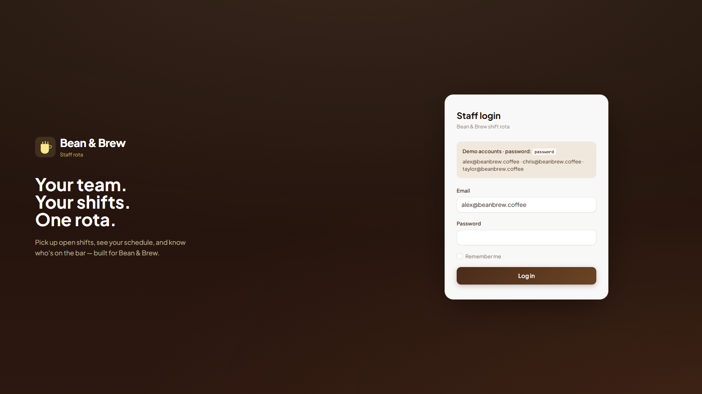
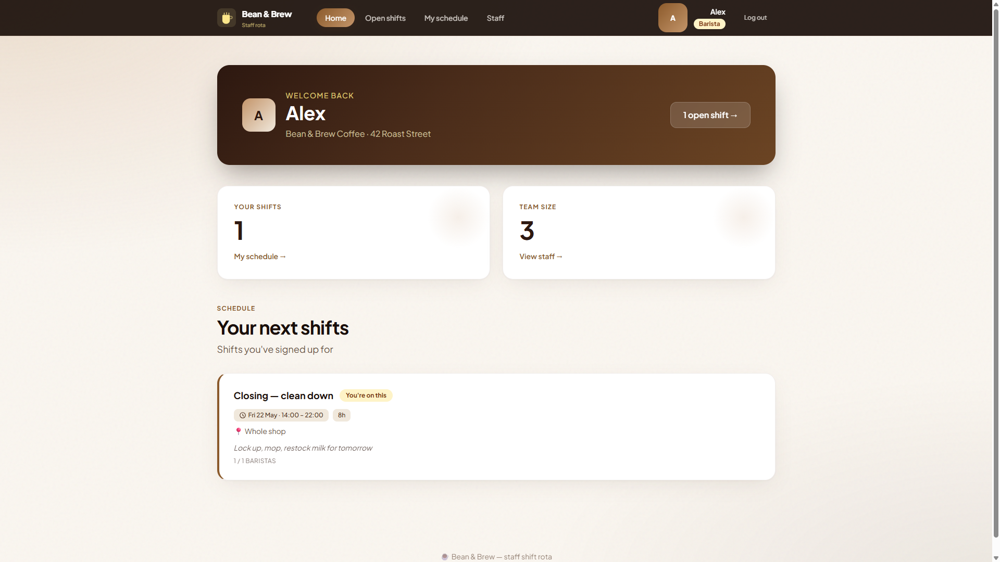
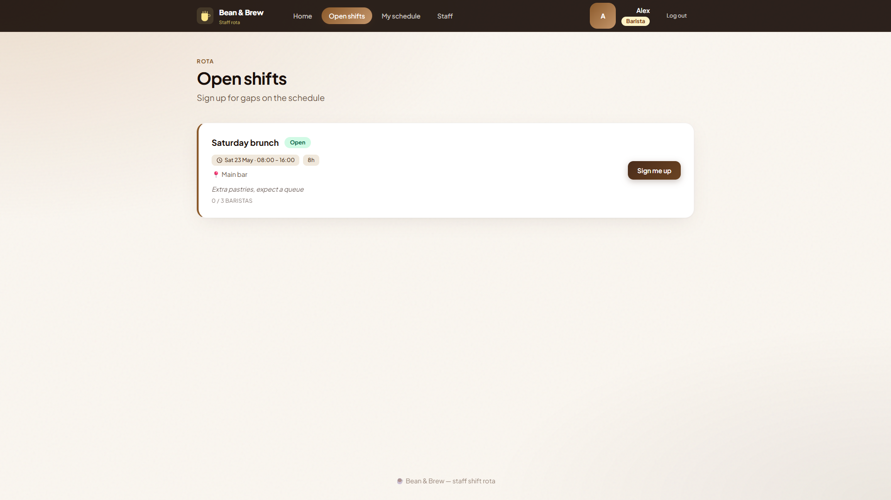
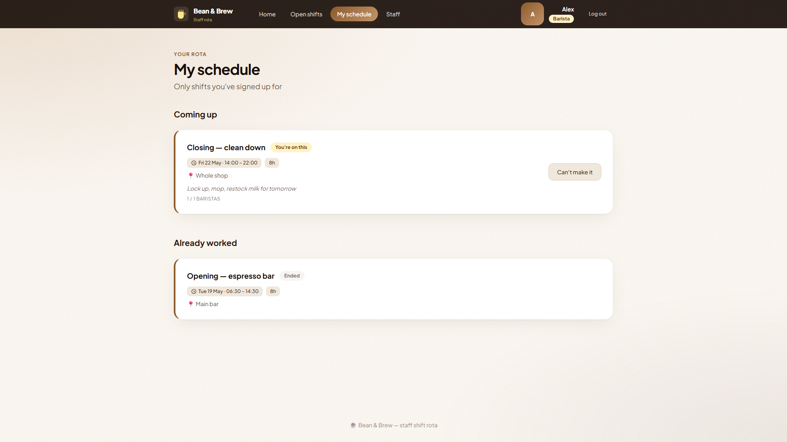
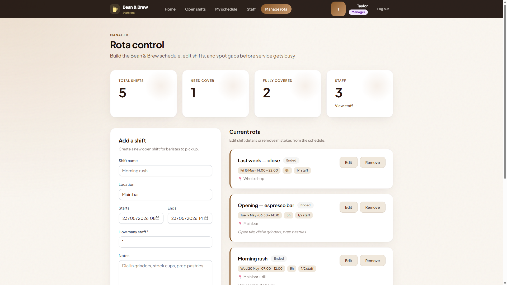

# Bean & Brew Staff Rota

A Laravel shift management app for a small coffee shop. Staff can log in, pick up open shifts, view their personal schedule, and managers can create, edit, and remove shifts from the rota.

## Features

- Staff login with Laravel Breeze authentication
- Open shift board for baristas
- Personal schedule page
- Staff directory
- Manager-only rota control panel
- Create, edit, and remove shifts
- Shift capacity tracking
- Coffee-shop themed UI with custom Blade components and Tailwind CSS
- Local demo database using SQLite

## Demo Accounts

All demo users use the password:

```text
password
```

| Role | Email |
| --- | --- |
| Barista | alex@beanbrew.coffee |
| Barista | chris@beanbrew.coffee |
| Manager | taylor@beanbrew.coffee |

Manager features are visible when logged in as Taylor.

## Screenshots

### Login



### Dashboard



### Open Shifts



### My Schedule



### Manager Rota



## Tech Stack

- PHP
- Laravel
- Laravel Breeze
- Blade templates
- Tailwind CSS
- Vite
- SQLite for local development

## Local Setup

Clone the repository and install dependencies:

```bash
composer install
npm install
```

Create your environment file:

```bash
cp .env.example .env
php artisan key:generate
```

Run the database migrations and seed demo data:

```bash
php artisan migrate:fresh --seed
```

Build frontend assets:

```bash
npm run build
```

## Running With Laravel Herd

If you use Laravel Herd, add this project folder to Herd's **Sites** section:

```text
C:\Users\alext\Projects\shift-manager
```

Herd should then serve the app at:

```text
http://shift-manager.test
```

Make sure you have already run:

```bash
composer install
npm install
php artisan migrate:fresh --seed
npm run build
```

You do not need `php artisan serve` when using Herd.

Alternatively, without Herd, run:

```bash
php artisan serve
```

## Database and Resetting Demo Data

This project uses SQLite for local development. SQLite stores the app data in a single file instead of needing a separate database server.

The local database file is:

```text
database/database.sqlite
```

This file stores demo users, teams, shifts, and which staff members have booked each shift.

To reset the database back to the demo state, run:

```bash
php artisan migrate:fresh --seed
```

This deletes the current local data, recreates the tables, and reloads the demo coffee shop data from:

```text
database/seeders/DatabaseSeeder.php
```

For a real hosted version, use MySQL or PostgreSQL instead of the local SQLite demo file.

## Important Files

| File | Purpose |
| --- | --- |
| `routes/web.php` | Web routes for dashboard, shifts, manager rota, and staff pages |
| `app/Http/Controllers/ShiftController.php` | Shift booking and manager rota logic |
| `app/Models/Shift.php` | Shift model, relationships, availability helpers |
| `app/Models/User.php` | User model, team/shift relationships, manager check |
| `resources/views/` | Blade UI templates |
| `resources/css/app.css` | Custom coffee-shop visual styling |
| `database/seeders/DatabaseSeeder.php` | Demo users, team, and shifts |

## Notes

This project is set up for local development and demonstration. For production hosting, use a real Laravel host and a production database such as MySQL or PostgreSQL instead of the local SQLite demo file.
